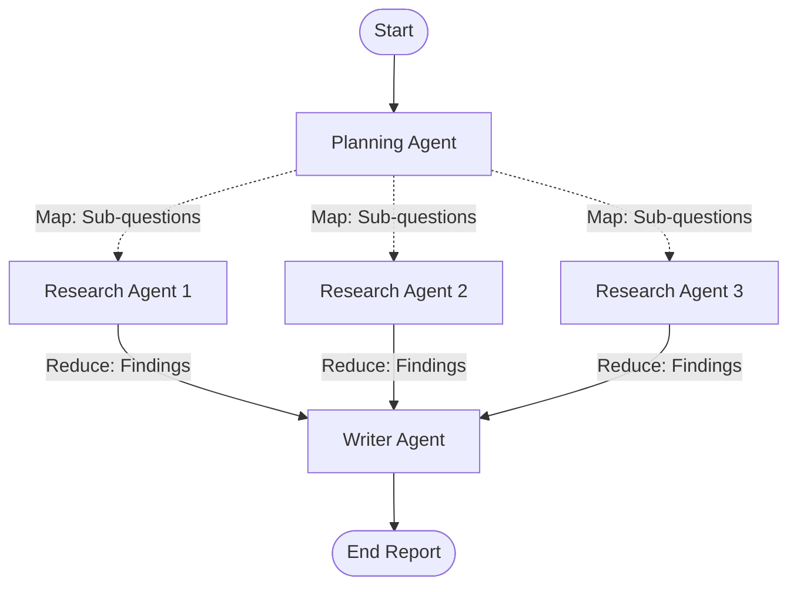

# 🌸 Multi-Agent Research System

An asynchronous, Map-Reduce Multi-Agent Research System built with **LangGraph**, **LangChain**, **Ollama**, and **Tavily Search**.

---

## 🏗️ Architecture Overview

The system uses a Map-Reduce orchestration pattern to decompose complex topics, conduct web research in parallel, and synthesize structured reports with citations:

1. **Planning Agent (`agents/planning_agent.py`)**: Breaks down the research query into distinct, focused sub-questions.
2. **Research Agent (`agents/research_agent.py`)**: Executes concurrent asynchronous web searches for each sub-question via Tavily (`tools/search_tool.py`).
3. **Writer Agent (`agents/writer_agent.py`)**: Aggregates all findings into a structured report with markdown citations.



---

## 📂 Project Structure

```text
.
├── agents/
│   ├── base_agent.py             # Base agent interface
│   ├── planning_agent.py         # Sub-question generator
│   ├── research_agent.py         # Async web research agent
│   └── writer_agent.py           # Structured report synthesizer
├── tools/
│   ├── base_tool.py              # Base tool interface
│   └── search_tool.py            # Tavily search tool encapsulation
├── orchestrators/
│   └── research_orchestrator.py  # LangGraph StateGraph workflow & routing
├── utils/
│   ├── logger.py                 # Rich logger & console formatting
│   └── helpers.py                # Pydantic parsing & prompt helpers
├── scripts/
│   └── visualize_workflow.py     # Script to visualize LangGraph workflow (Mermaid)
├── tests/
│   ├── test_agents.py            # Unit tests for individual agents
│   └── test_orchestrator.py      # Integration tests for the StateGraph
├── config.py                     # Environment & model configurations
├── schemas.py                    # Pydantic data models & contracts
├── main.py                       # Main CLI entry point
└── requirements.txt              # Project dependencies
```

---

## 🚀 Getting Started

### 1. Installation
```bash
# Clone the repository and install dependencies
pip install -r requirements.txt
```

### 2. Environment Configuration
Create a `.env` file in the root directory:
```env
OLLAMA_BASE_URL=http://localhost:11434
OLLAMA_MODEL=llama3
TAVILY_API_KEY=your_tavily_api_key_here
```

### 3. Running the Research System
```bash
python main.py --query "Impact of Quantum Computing on Modern Cryptography"
```

### 4. Visualizing Workflow
```bash
python scripts/visualize_workflow.py
```

### 5. Running Tests
```bash
python -m tests.test_orchestrator
python -m tests.test_agents --query "Explain Agentic AI"
```
