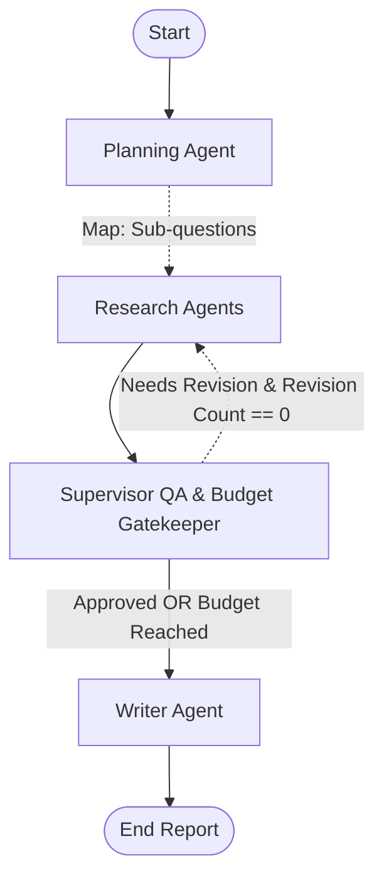

# 🌸 Multi-Agent Research System (Phase 2)

An asynchronous, Map-Reduce Multi-Agent Research System with **Supervisor Quality Assurance & Budget Enforcements** built with **LangGraph**, **LangChain**, **Ollama**, and **Tavily Search**.

---

## 🏗️ Architecture Overview

The system uses a state machine orchestration pattern with a Quality Assurance Supervisor loop:

1. **Planning Agent (`agents/planning_agent.py`)**: Breaks down the research query into distinct, focused sub-questions.
2. **Research Agent (`agents/research_agent.py`)**: Executes concurrent asynchronous web searches for each sub-question via Tavily (`tools/search_tool.py`).
3. **Supervisor Agent (`agents/supervisor_agent.py`)**: Evaluates research findings against the plan, enforces budget constraints, and coordinates targeted re-search (exact-once revision loop).
4. **Writer Agent (`agents/writer_agent.py`)**: Synthesizes all merged and deduplicated findings into a structured report with markdown citations.



---

## 💰 Budget Constraints & Enforcements

| Constraint | Default | CLI Override | Description |
| :--- | :---: | :---: | :--- |
| **Wall-clock Timeout** | `60.0s` | `--timeout` | Hard execution time ceiling |
| **Max Sub-questions** | `3` | `--max-sub-questions` | Limits the number of research sub-topics |
| **Max Total Tokens** | `8000` | `--max-tokens` | Estimated token consumption ceiling |
| **Max Revisions** | `1` | Fixed (Exact-once) | Guarantees at most 1 revision pass |

---

## 📂 Project Structure

```text
.
├── agents/
│   ├── base_agent.py             # Base agent interface
│   ├── planning_agent.py         # Sub-question generator
│   ├── research_agent.py         # Async web research agent
│   ├── supervisor_agent.py       # QA evaluator & budget gatekeeper
│   └── writer_agent.py           # Structured report synthesizer
├── tools/
│   ├── base_tool.py              # Base tool interface
│   └── search_tool.py            # Tavily search tool encapsulation
├── orchestrators/
│   └── research_orchestrator.py  # LangGraph StateGraph workflow with Supervisor
├── utils/
│   ├── logger.py                 # Rich logger & console formatting
│   └── helpers.py                # Pydantic parsing & prompt helpers
├── scripts/
│   └── visualize_workflow.py     # Script to visualize LangGraph workflow (Mermaid)
├── tests/
│   ├── test_agents.py            # Unit tests for individual agents
│   └── test_orchestrator.py      # Integration tests for the StateGraph
├── config.py                     # Environment & model configurations
├── schemas.py                    # Pydantic data models & contracts
├── main.py                       # Main CLI entry point with budget flags
└── requirements.txt              # Project dependencies
```

---

## 🚀 Getting Started

### 1. Running the Research System
```bash
python main.py --query "Impact of Quantum Computing on Modern Cryptography" --timeout 60 --max-sub-questions 3
```

### 2. Testing Individual Agents
```bash
# Test Planner
python tests/test_agents.py --agent planner --query "What is Agentic AI?"

# Test Researcher
python tests/test_agents.py --agent researcher --query "Key components of AI Agents"

# Test Supervisor
python tests/test_agents.py --agent supervisor --query "What is Agentic AI?"

# Test Writer
python tests/test_agents.py --agent writer --query "What is Agentic AI?"

# Test All
python tests/test_agents.py --agent all
```

### 3. Visualizing Workflow
```bash
python scripts/visualize_workflow.py
```
